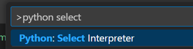

### Init install uv packaging
```bash
pip install uv
```

### Init the project
```bash
uv init --python 3.13
```

### Created the virtual enviroment
```bash
uv run python -V
```

### Go to the cmd in the VS Code

* Select `Ctrl`+`Shift`+`P`
* Then choose to the 



And then choose the created virtual enviroment e.g.
`path/to/dir/.venv/bin/python`

Finally, you are good to go!